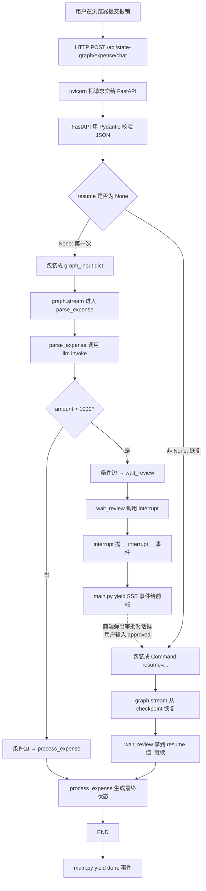
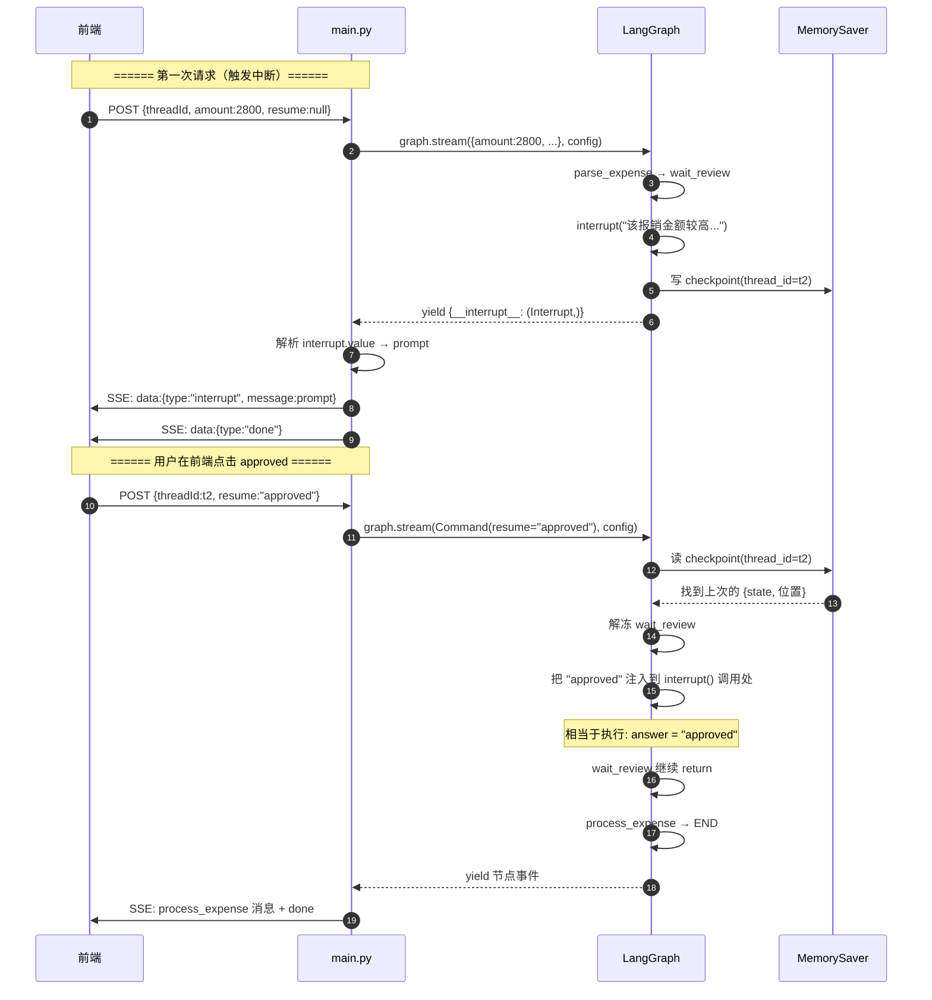
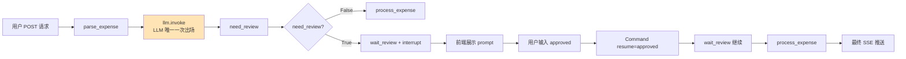

# LangGraph 报销审批流程 - 详细讲解（方法调用版）

> 本文把"用户点击报销按钮"到"前端收到最终 SSE 事件"中间**所有方法的调用链**全部串起来讲。
> 适合：刚接触 LangGraph + FastAPI + SSE，想搞清楚"每个方法干嘛的、谁调谁的"的读者。

---

## 一、整体一览

### 1.1 项目结构

```
补9月7号审批作业/
├── .env                       # 通义千问 API key / model / base_url
├── main.py                    # FastAPI 入口：接收 HTTP 请求、生成 SSE 事件
├── model/
│   └── ExpenseChatRequest.py  # Pydantic 请求体定义
└── node/
    └── expenseGraph.py        # OverAllState + 3 个节点 + StateGraph 编排
```

### 1.2 技术栈

| 组件 | 作用 |
|---|---|
| **uvicorn** | ASGI 服务器，启动 FastAPI app |
| **FastAPI** | 提供 HTTP 接口、把 Python 函数转成 REST API |
| **Pydantic BaseModel** | 自动校验请求体 JSON 的字段类型 |
| **LangGraph StateGraph** | 编排流程图（节点 + 边 + 条件边） |
| **LangGraph MemorySaver** | 把流程 checkpoint 存到内存（按 thread_id） |
| **LangGraph interrupt()** | 暂停图执行，等待人工输入 |
| **LangGraph Command(resume=)** | 从中断点恢复 |
| **LangChain ChatOpenAI** | OpenAI 兼容协议的 LLM 客户端 |
| **dotenv** | 从 .env 文件读环境变量 |
| **StreamingResponse** | FastAPI 的流式响应（SSE） |
| **json.dumps** | Python 对象 → JSON 字符串 |

---

## 二、流程全景图（用户视角）



---

## 三、全栈方法调用链（按用户请求的时间顺序）

下面是**一次 HTTP 请求**经过的所有方法调用，按调用顺序排列：

```
┌────────────────────────────────────────────────────────────────────┐
│ 1. 启动阶段（main.py 被 python 执行）                                  │
├────────────────────────────────────────────────────────────────────┤
│ python main.py                                                      │
│   └─→ uvicorn.run(app, host=..., port=..., log_level="info")        │
│         ├─ 创建 ASGI 服务器                                          │
│         ├─ 加载 app（执行 main.py 顶层代码）                          │
│         │     ├─ load_dotenv()                    读 .env 进 os.environ│
│         │     ├─ from node.expenseGraph import compiled_expense_graph │
│         │     │     └─ ChatOpenAI(...)            实例化 LLM 客户端    │
│         │     │     └─ StateGraph(OverAllState)   创建图构造器         │
│         │     │     └─ add_node/add_edge/add_conditional_edges       │
│         │     │     └─ .compile(checkpointer=MemorySaver())          │
│         │     │           └─ MemorySaver.__init__  初始化内存字典      │
│         │     └─ FastAPI()                        创建 app 实例        │
│         └─ 监听 9999 端口                                              │
└────────────────────────────────────────────────────────────────────┘

┌────────────────────────────────────────────────────────────────────┐
│ 2. 请求到达阶段（前端发起 POST）                                       │
├────────────────────────────────────────────────────────────────────┤
│ uvicorn 收到 HTTP 请求                                                │
│   └─→ FastAPI 路由匹配                                                │
│         └─→ @app.post("/api/state-graph/expense/chat") 装饰的函数     │
│               形参 req: ExpenseChatRequest                           │
│                                                                     │
│ FastAPI 内部完成（你看不到）：                                          │
│   ├─→ ExpenseChatRequest.__init__(**request_json)                   │
│   │      ├─ 校验 threadId 是 str                                     │
│   │      ├─ 校验 amount 是 float | None                              │
│   │      ├─ 校验 reason 是 str | None                                │
│   │      └─ 校验 resume 是 str | None                                │
│   └─→ 调用你的 handler 函数 expense_chat(req)                        │
└────────────────────────────────────────────────────────────────────┘

┌────────────────────────────────────────────────────────────────────┐
│ 3. handler 处理阶段（main.py 的 expense_chat 函数）                    │
├────────────────────────────────────────────────────────────────────┤
│ def expense_chat(req: ExpenseChatRequest):                            │
│   ├─→ 定义 stream_event() 嵌套函数（生成器）                            │
│   ├─→ config = {"configurable": {"thread_id": req.threadId}}        │
│   ├─→ if req.resume is None:                                         │
│   │      graph_input = {"amount": req.amount, "reason": req.reason}  │
│   │   else:                                                          │
│   │      graph_input = Command(resume=req.resume)                    │
│   │              └─ Command.__init__(resume="approved")              │
│   │                  └─ 创建一个 resume 命令对象                       │
│   └─→ return StreamingResponse(stream_event(),                       │
│                                media_type="text/event-stream")       │
│          └─ StreamingResponse.__init__(...)  返回流式响应             │
│                └─ FastAPI 把生成器包装成 SSE 响应                     │
└────────────────────────────────────────────────────────────────────┘

┌────────────────────────────────────────────────────────────────────┐
│ 4. graph 执行阶段（main.py 进入 for 循环）                              │
├────────────────────────────────────────────────────────────────────┤
│ for node in compiled_expense_graph.stream(graph_input, config):     │
│   └─→ graph.stream() 内部依次：                                       │
│         ├─ 从 MemorySaver 读 thread_id 对应的 checkpoint            │
│         ├─ 从 START 节点开始                                          │
│         ├─ 调 parse_expense(state)                                    │
│         │     ├─ llm.invoke(prompt)                                  │
│         │     │    └─ httpx.post(QWEN_BASE_URL + "/chat/completions")│
│         │     │         ├─ headers: Authorization: Bearer $KEY      │
│         │     │         └─ body: {"model": "qwen-plus", "messages":...}│
│         │     │    └─ 解析返回的 JSON，得到 AIMessage                │
│         │     ├─ 计算 need_review = amount > 1000                    │
│         │     └─ return {"amount", "reason", "need_review"}          │
│         │           └─ LangGraph 把返回值 merge 到 OverAllState      │
│         ├─ 跑条件边 lambda state: "wait_review"/"process_expense"   │
│         ├─ 调到目标节点                                                │
│         └─ yield {节点名: 节点返回值} 给 main.py                      │
└────────────────────────────────────────────────────────────────────┘

┌────────────────────────────────────────────────────────────────────┐
│ 5. 节点 wait_review 触发中断                                          │
├────────────────────────────────────────────────────────────────────┤
│ def wait_review(state):                                              │
│   ├─ prompt = f"该报销金额较高..."                                   │
│   ├─ answer = interrupt(prompt)                                      │
│   │     └─ interrupt() 内部：                                         │
│   │           ├─ 把 {prompt, state, 节点位置} 写到 MemorySaver       │
│   │           ├─ 在图执行上下文里抛 Interrupt 异常                    │
│   │           └─ LangGraph 捕获异常，停止往后跑                       │
│   └─ (后面代码不执行，等恢复)                                          │
│                                                                     │
│ graph.stream() 捕获到中断，yield:                                    │
│   {"__interrupt__": (Interrupt(value=payload),)}                     │
│                                                                     │
│ main.py 收到这个事件：                                                │
│   if "__interrupt__" in node:                                        │
│     interrupt = node["__interrupt__"][0]      # Interrupt 对象       │
│     value = interrupt.value                   # 取出 payload 字典     │
│     message = value.get("message", str(value))                       │
│     payload = json.dumps({...}, ensure_ascii=False)                  │
│     yield f"data:{payload}\n\n"               # 推 SSE 给前端         │
└────────────────────────────────────────────────────────────────────┘

┌────────────────────────────────────────────────────────────────────┐
│ 6. 用户输入后，二次请求 → 恢复执行                                       │
├────────────────────────────────────────────────────────────────────┤
│ 第二次 POST /api/state-graph/expense/chat                            │
│   {threadId: "t2", resume: "approved"}                               │
│                                                                     │
│ graph_input = Command(resume="approved")                             │
│                                                                     │
│ graph.stream(Command(resume=...), config):                           │
│   ├─ 读 MemorySaver checkpoint（thread_id="t2"）                     │
│   ├─ 找到上次冻结位置：wait_review 的 interrupt() 调用处              │
│   ├─ 把 "approved" 当作 interrupt() 的返回值                         │
│   ├─ wait_review 继续执行：                                           │
│   │     answer = "approved"                                          │
│   │     return {"review_result": "approved"}                         │
│   ├─ LangGraph merge 到 OverAllState                                │
│   ├─ 走边：wait_review → process_expense                            │
│   ├─ 调 process_expense(state)                                       │
│   │     ├─ 读 need_review, review_result                             │
│   │     ├─ 生成 process_status="MANUAL_APPROVED"                     │
│   │     ├─ 生成 process_result="..."                                 │
│   │     └─ return {process_status, process_result}                   │
│   ├─ 走边：process_expense → END                                    │
│   └─ for 循环结束                                                    │
│                                                                     │
│ main.py 收到所有节点事件，最后 yield "data:{type:'done'}\n\n"        │
└────────────────────────────────────────────────────────────────────┘
```

---

## 四、生命周期实战追踪

### 场景 A：低金额自动通过（amount = 500.5）

#### 用户操作

```http
POST http://127.0.0.1:9999/api/state-graph/expense/chat
Content-Type: application/json

{
  "threadId": "t-low-001",
  "amount": 500.5,
  "reason": "购买办公用品",
  "resume": null
}
```

#### 方法调用逐帧

| 步骤 | 调用者 | 被调方法 | 参数 / 输入 | 返回 / 副作用 |
|---|---|---|---|---|
| 1 | uvicorn | `FastAPI 路由分发` | HTTP POST | 命中 `expense_chat` |
| 2 | FastAPI | `ExpenseChatRequest.__init__` | `{threadId, amount, reason, resume}` | 校验通过的 req 对象 |
| 3 | FastAPI | `expense_chat(req)` | req | 进入函数体 |
| 4 | expense_chat | `dict 构造` | `{"configurable":{"thread_id":req.threadId}}` | config dict |
| 5 | expense_chat | `req.resume is None` 判断 | req | True |
| 6 | expense_chat | `dict 构造` | `{"amount":500.5,"reason":"购买办公用品"}` | graph_input |
| 7 | expense_chat | `StreamingResponse(...)` | generator + media_type | Response 对象 |
| 8 | FastAPI | 进入 `stream_event()` 生成器 | — | 准备 yield |
| 9 | stream_event | `compiled_expense_graph.stream(...)` | graph_input, config | 返回迭代器 |
| 10 | LangGraph | 读 MemorySaver | thread_id="t-low-001" | 无 checkpoint，新建 |
| 11 | LangGraph | 走 `START → parse_expense` | — | — |
| 12 | LangGraph | `parse_expense(state)` | `{amount:500.5, reason:...}` | — |
| 13 | parse_expense | `llm.invoke(prompt)` | 字符串 | AIMessage 对象 |
| 14 | ChatOpenAI | `httpx.post(...)` | URL + headers + body | Response 对象 |
| 15 | httpx | `tcp 连接 → 通义千问服务器` | — | JSON 响应 |
| 16 | ChatOpenAI | 解析 OpenAI 协议 JSON | — | AIMessage |
| 17 | parse_expense | 计算 `need_review = 500.5 > 1000` | — | False |
| 18 | parse_expense | `return {amount, reason, need_review}` | — | dict |
| 19 | LangGraph | `state.update(...)` | 返回 dict | state 合并 |
| 20 | LangGraph | 走条件边 `lambda state: ...` | state | 返回 "process_expense" |
| 21 | LangGraph | 走到 `process_expense` 节点 | — | — |
| 22 | LangGraph | `process_expense(state)` | state | — |
| 23 | process_expense | `if not need_review:` | True | 进入自动通过分支 |
| 24 | process_expense | 字符串拼接 f"..." | amount, reason | process_result |
| 25 | process_expense | `return {process_status, process_result}` | — | dict |
| 26 | LangGraph | `state.update(...)` | 返回 dict | state 合并 |
| 27 | LangGraph | 走 `process_expense → END` | — | — |
| 28 | LangGraph | `yield {"parse_expense": {...}}` | — | 给 stream 迭代器 |
| 29 | LangGraph | `yield {"process_expense": {...}}` | — | 给 stream 迭代器 |
| 30 | LangGraph | 迭代器结束 | — | for 循环退出 |
| 31 | stream_event | `json.dumps(...)` | dict | 字符串 |
| 32 | stream_event | `yield f"data:{payload}\n\n"` | 字符串 | SSE 帧 |
| 33 | uvicorn | TCP send | SSE 帧 | 浏览器收到 |
| 34 | stream_event | `yield done` | — | SSE 帧 |
| 35 | uvicorn | 关闭流 | — | HTTP 200 |

#### 前端看到的 SSE

```
data:{"type": "node", "node": "parse_expense"}
data:{"type": "node", "node": "process_expense", "message": "报销金额较低，系统自动审批通过，进入财务打款流程。金额：500.5，原因：购买办公用品"}
data: {"type": "done"}
```

✅ 全程只走了一遍 `parse_expense → process_expense`，没有中断。

---

### 场景 B：高金额人工审批（amount = 2800）

#### 第一次请求（触发中断）

```http
POST /api/state-graph/expense/chat
{ "threadId": "t-high-001", "amount": 2800, "reason": "参加 Java 培训", "resume": null }
```

步骤 1-20 与场景 A 相同，但：
- 步骤 17：`need_review = 2800 > 1000` → **True**
- 步骤 20：条件边 lambda 返回 `"wait_review"`

继续：

| 步骤 | 调用者 | 被调方法 | 参数 / 输入 | 返回 / 副作用 |
|---|---|---|---|---|
| 21 | LangGraph | 走到 `wait_review` 节点 | — | — |
| 22 | LangGraph | `wait_review(state)` | state | — |
| 23 | wait_review | 拼 `prompt` 字符串 | amount, reason | "该报销金额较高..." |
| 24 | wait_review | `interrupt(prompt)` | prompt | **抛 Interrupt 异常** |
| 25 | LangGraph 内部 | 把 checkpoint 写入 MemorySaver | state + 节点位置 + prompt | 内存字典新增条目 |
| 26 | LangGraph 内部 | 把 Interrupt 异常包装成事件 | — | `{"__interrupt__": (Interrupt(value={...}),)}` |
| 27 | LangGraph | yield 这个事件 | — | 给 stream 迭代器 |
| 28 | main.py 循环 | `if "__interrupt__" in node:` | True | 进入中断分支 |
| 29 | main.py | `node["__interrupt__"][0]` | dict | Interrupt 对象 |
| 30 | main.py | `interrupt.value` | Interrupt 对象 | payload dict |
| 31 | main.py | `json.dumps(...)` | dict | 字符串 |
| 32 | main.py | `yield f"data:{payload}\n\n"` | 字符串 | SSE 帧推到前端 |
| 33 | main.py 循环 | for 结束 | — | — |
| 34 | main.py | `yield done` | — | SSE 帧 |

#### 前端看到的 SSE（第一次）

```
data:{"type": "node", "node": "parse_expense"}
data:{"type": "interrupt", "node": "wait_review", "message": "该报销金额较高，需要人工审批。金额：2800.0，原因：参加 Java 培训。请输入 approved 或 rejected"}
data: {"type": "done"}
```

#### 第二次请求（resume=approved）

```http
POST /api/state-graph/expense/chat
{ "threadId": "t-high-001", "resume": "approved" }
```

| 步骤 | 调用者 | 被调方法 | 参数 / 输入 | 返回 / 副作用 |
|---|---|---|---|---|
| 1-8 | 同场景 A | — | — | — |
| 9 | main.py | `req.resume is None` | False | 进入恢复分支 |
| 10 | main.py | `Command(resume="approved")` | 字符串 | Command 对象 |
| 11 | stream | `compiled_expense_graph.stream(Command, config)` | Command, config | 迭代器 |
| 12 | LangGraph | 读 MemorySaver | thread_id | 找到上次 checkpoint |
| 13 | LangGraph | 定位到 `wait_review.interrupt()` | — | 解冻 |
| 14 | LangGraph | 把 `"approved"` 注入到 `interrupt()` 调用处 | — | wait_review 继续 |
| 15 | LangGraph | `wait_review(state)` 恢复执行 | state, answer="approved" | — |
| 16 | wait_review | `return {"review_result": "approved"}` | — | dict |
| 17 | LangGraph | state 合并 review_result | — | state 更新 |
| 18 | LangGraph | 走 `wait_review → process_expense` 边 | — | — |
| 19-23 | 同场景 A 步骤 22-26 | — | — | process_expense 执行 |
| 24 | process_expense | `elif review_result == "approved":` | True | 走通过分支 |
| 25 | process_expense | 拼 result 字符串 | — | "报销申请已通过..." |
| 26 | LangGraph | yield `{"wait_review": {...}}` | — | 节点事件 |
| 27 | LangGraph | yield `{"process_expense": {...}}` | — | 节点事件 |
| 28 | main.py | yield 三条 SSE 帧 | — | — |

#### 前端看到的 SSE（第二次）

```
data:{"type": "node", "node": "wait_review"}
data:{"type": "node", "node": "process_expense", "message": "报销申请已通过人工审批，进入财务打款流程。金额：2800.0，原因：参加 Java 培训"}
data: {"type": "done"}
```

---

## 五、核心方法逐一解析

### 5.1 uvicorn.run

```python
uvicorn.run(app, host="127.0.0.1", port=9999, log_level="info")
```

- **作用**：把 FastAPI app 启动成一个 ASGI 服务器
- **内部**：
  - 创建 socket 监听端口
  - 加载 app（执行 `main.py` 顶层代码，包括 graph 编译）
  - 进入事件循环，分发 HTTP 请求给 FastAPI
- **为什么是 ASGI 而不是 WSGI**：因为我们要用 `StreamingResponse`，需要异步流式响应能力

### 5.2 FastAPI() + @app.post

```python
app = FastAPI()

@app.post("/api/state-graph/expense/chat")
def expense_chat(req: ExpenseChatRequest):
    ...
```

- **作用**：注册一个 POST 接口
- **装饰器干了什么**：
  - 把函数注册到路由表 `app.routes`
  - 把函数签名解析成 OpenAPI schema
  - 启动时打印 `POST /api/state-graph/expense/chat` 日志
- **请求到达时**：FastAPI 解析请求 → 匹配路由 → 用 Pydantic 校验 body → 调函数

### 5.3 Pydantic BaseModel

```python
class ExpenseChatRequest(BaseModel):
    threadId: str
    amount: float | None = None
    reason: str | None = None
    resume: str | None = None
```

- **自动行为**：
  - 收到 JSON → `ExpenseChatRequest(**json_data)`
  - 如果 `threadId` 不是 str → 抛 422 错误
  - 如果 `amount` 字段缺失 → 用默认值 None
  - 如果 `amount` 是字符串 "500" → 自动转 float 500
- **IDE 友好**：编辑器能根据类型注解做自动补全和类型检查

### 5.4 StreamingResponse

```python
return StreamingResponse(stream_event(), media_type="text/event-stream")
```

- **作用**：把一个 Python 生成器包装成 SSE 响应
- **工作流程**：
  1. FastAPI 把生成器接入 ASGI 协议
  2. 每当生成器 `yield` 一段数据，ASGI 服务器就把它作为 HTTP body chunk 发给客户端
  3. 生成器结束，连接关闭
- **`media_type="text/event-stream"`** 让浏览器知道这是 SSE，会按 SSE 协议解析（每个 chunk 都是 `data: ...\n\n`）

### 5.5 LangGraph StateGraph

```python
from langgraph.graph import StateGraph
from langgraph.constants import START, END

expense_graph = StateGraph(OverAllState)              # 1. 创建图构造器
expense_graph.add_node("parse_expense", parse_expense)  # 2. 注册节点
expense_graph.add_edge(START, "parse_expense")           # 3. 加边
expense_graph.add_conditional_edges(...)                # 4. 加条件边
expense_graph.compile(checkpointer=MemorySaver())       # 5. 编译
```

- **StateGraph(state_schema)**：构造时指定 state 的类型（这里是 TypedDict）
- **add_node(name, func)**：注册一个节点，name 是唯一标识，func 是节点函数
- **add_edge(from, to)**：固定边，跑完 from 一定去 to
- **add_conditional_edges(from, router, path_map)**：
  - `router(state)` 返回字符串
  - `path_map[字符串]` 是目标节点
- **compile(checkpointer=)**：冻结图，返回 `CompiledStateGraph`
  - `CompiledStateGraph.stream(input, config)` 才开始真正执行

### 5.6 LangGraph interrupt + Command(resume)

```python
from langgraph.types import interrupt, Command

def wait_review(state):
    answer = interrupt(prompt)            # ← 第一次：抛异常冻结
    return {"review_result": answer}

# 恢复时
graph.stream(Command(resume="approved"), config)
```

- **interrupt(payload)**：
  1. 把 payload + 当前 state + 节点位置写入 checkpointer
  2. 抛 `Interrupt` 异常，让 LangGraph 停止往下跑
  3. 异常被 LangGraph 捕获，包成 `__interrupt__` 事件 yield 出去
- **Command(resume=value)**：
  1. LangGraph 读 checkpointer 找到冻结位置
  2. 把 value 当作上次 `interrupt()` 调用的返回值
  3. 节点函数从 `interrupt()` 调用处继续往下执行
- **关键点**：同一个 `thread_id` 才能找到同一个 checkpoint

### 5.7 LangGraph MemorySaver

```python
from langgraph.checkpoint.memory import MemorySaver

compiled_expense_graph = expense_graph.compile(checkpointer=MemorySaver())
```

- **本质**：一个进程级字典 `{thread_id: [checkpoint, checkpoint, ...]}`
- **每次图执行到关键节点**（特别是 `interrupt`）就追加一个 checkpoint
- **每个 checkpoint 包含**：当时的完整 state + 当前位置
- **重启服务就丢**：因为是内存字典，生产环境应该用 SqliteSaver / PostgresSaver

### 5.8 LangChain ChatOpenAI

```python
from langchain_openai import ChatOpenAI

llm = ChatOpenAI(
    model="qwen-plus",
    api_key=os.getenv("DASHSCOPE_API_KEY"),
    base_url="https://dashscope.aliyuncs.com/compatible-mode/v1",
    temperature=0,
)
```

- **作用**：用 OpenAI 协议调任何兼容 LLM（这里是通义千问）
- **invoke(prompt)**：
  1. 把 prompt 包成 OpenAI 协议的 messages 数组
  2. 用 httpx 发 POST 到 `base_url + "/chat/completions"`
  3. 带 `Authorization: Bearer $api_key`
  4. 解析响应，包成 AIMessage 返回
- **temperature=0**：让输出尽量确定（同样输入同样输出），便于演示
- **同步调用**：阻塞等响应；如果要异步用 `ainvoke()`

### 5.9 dotenv.load_dotenv

```python
from dotenv import load_dotenv
load_dotenv()
```

- **作用**：读项目根目录的 `.env` 文件，把 key=value 写入 `os.environ`
- **执行时机**：必须在 `ChatOpenAI(...)` 构造之前调用，否则它读不到 API key

### 5.10 json.dumps(ensure_ascii=False)

```python
payload = json.dumps({"type": "interrupt", "message": "报销..."}, ensure_ascii=False)
yield f"data:{payload}\n\n"
```

- **ensure_ascii=False**：默认会把中文转成 `\uXXXX`，设为 False 后直接输出 UTF-8 中文
- **SSE 帧格式**：`data:` + JSON + `\n\n`（两个换行是 SSE 帧分隔符）

---

## 六、关键代码索引表

| 想改什么 | 文件 | 行/函数 |
|---|---|---|
| 报销金额阈值 | `node/expenseGraph.py` | `parse_expense` 里的 `amount > 1000` |
| 中断提示文案 | `node/expenseGraph.py` | `wait_review` 里的 `prompt = f"..."` |
| 最终结果文案 | `node/expenseGraph.py` | `process_expense` 里的 `result = f"..."` |
| 加新节点 | `node/expenseGraph.py` | `add_node(...)` + `add_edge(...)` |
| 加新接口路径 | `main.py` | `@app.post("/api/...")` |
| 改请求字段 | `model/ExpenseChatRequest.py` | Pydantic 类 |
| 换 LLM（DeepSeek / Ollama） | `node/expenseGraph.py` | 顶部 `ChatOpenAI(...)` 改 base_url/api_key |
| 改成异步流 | `main.py` | `expense_chat` 改 `async def`，`astream` 替换 `stream` |
| 持久化存档 | `node/expenseGraph.py` | `MemorySaver` 改 `SqliteSaver.from_conn_string("xxx.db")` |

---

## 七、自测脚本

启动服务：
```bash
cd "C:\Users\Lenovo\Desktop\python_workplace\MyfastApiProject\LangGraph\补9月7号审批作业"
python main.py
```

另开终端：

```bash
# 场景 A：低金额自动通过
curl -s -N -X POST http://127.0.0.1:9999/api/state-graph/expense/chat \
  -H "Content-Type: application/json" \
  -d '{"threadId":"t1","amount":500.5,"reason":"购买办公用品"}'

# 场景 B1：高金额首次（应该看到 interrupt）
curl -s -N -X POST http://127.0.0.1:9999/api/state-graph/expense/chat \
  -H "Content-Type: application/json" \
  -d '{"threadId":"t2","amount":2800,"reason":"参加 Java 培训"}'

# 场景 B2：resume=approved
curl -s -N -X POST http://127.0.0.1:9999/api/state-graph/expense/chat \
  -H "Content-Type: application/json" \
  -d '{"threadId":"t2","resume":"approved"}'

# 场景 C：resume=rejected
curl -s -N -X POST http://127.0.0.1:9999/api/state-graph/expense/chat \
  -H "Content-Type: application/json" \
  -d '{"threadId":"t3","amount":3500,"reason":"出差餐饮"}'
curl -s -N -X POST http://127.0.0.1:9999/api/state-graph/expense/chat \
  -H "Content-Type: application/json" \
  -d '{"threadId":"t3","resume":"rejected"}'
```

---

## 八、易踩的坑

| 现象 | 原因 | 解法 |
|---|---|---|
| 改了代码但 SSE 还是旧结果 | graph 实例在 import 时已 compile 完 | 重启服务 |
| `resume` 报"找不到节点" | 用了不同 threadId | 保持 threadId 一致 |
| 中断后重启服务丢失 | MemorySaver 是内存 | 用 SqliteSaver |
| IDEA 报"未解析引用 OverAllState" | 中文路径 + 索引缓存 | 把 OverAllState 定义在使用方同文件 |
| httpx 报 401 / 403 | api_key 错误或 base_url 错 | 检查 .env |
| 通义千问报 rate limit | QPS 超限 | 加 sleep / 换付费模型 |
| SSE 输出中文乱码 | json.dumps 默认 ensure_ascii=True | 加 `ensure_ascii=False` |
| 前端 EventSource 收不到数据 | 后端没设置正确的 CORS / Cache-Control | 加 `Cache-Control: no-cache` 头 |

---

## 九、扩展练习（按难度排序）

1. **改阈值**：把 `amount > 1000` 改成 `amount > 500`，重启验证
2. **加 reject 理由**：让 wait_review 不光返回 approved/rejected，还返回一段文字理由
3. **换 LLM**：把 ChatOpenAI 换成 DeepSeek 或 Ollama 本地模型
4. **加邮件通知**：process_expense 后加一个 `send_email` 节点，调 SMTP 发邮件
5. **持久化**：用 SqliteSaver 替换 MemorySaver，重启服务后历史 thread 还在不在
6. **加新路由**：再写一个 `/api/state-graph/order/chat` 接口做订单审批，复用 LangGraph 套路
7. **加 SSE 心跳**：流式响应里每 5 秒推一条心跳事件，避免代理超时断开
8. **加单元测试**：用 pytest 测 parse_expense / wait_review / process_expense 三个节点函数

每个练习都建议先想清楚改动会触及哪些文件，再用第六节的"关键代码索引表"定位。

---

## 十、`interrupt()` 流转详解（FAQ 专题）

### 10.1 interrupt 会调用 LLM 吗？

**不会。** `interrupt()` 是 LangGraph 自己的一套图执行控制机制，跟 LLM 没有任何关系。LLM 只在 `parse_expense` 节点被调用过一次，用来"处理用户最初的报销申请"。

### 10.2 interrupt 的本质：抛异常冻结

`interrupt(prompt)` 看起来像普通函数调用，但内部是个"抛异常"操作：

```python
# LangGraph 内部伪代码（简化版）
def interrupt(payload):
    if is_resuming:                  # 第二次（Command(resume=...) 触发）
        return get_resume_value()    # ← 就像普通 return
    else:                            # 第一次
        save_checkpoint({state, interrupt, position})
        raise GraphInterrupt(payload)  # ← 抛异常冻结
```

**对节点函数作者来说**，`interrupt()` 看起来是同步阻塞地"等用户输入"。
**对 LangGraph 来说**，实际上是**两次执行 + 中间靠 MemorySaver 串起来**。

| 时机 | 行为 |
|---|---|
| 第一次 HTTP 请求 | 函数执行到 `interrupt()` 行就停住，**走不到 return** |
| 第二次 HTTP 请求（Command(resume=...)）| 函数**重新被调用**，但这次 `interrupt()` 直接 return 值，**然后才走到 return** |

### 10.3 中断-恢复的 6 步 sequence diagram



### 10.4 那 `prompt` 这个参数是干嘛的？

`prompt` 在 `interrupt(prompt)` 里**不是给 LangGraph 用的**，是**给前端用的**。

```python
def wait_review(state):
    prompt = "该报销金额较高..."     # ← 纯字符串
    answer = interrupt(prompt)      # ← LangGraph 只把它存起来
```

- LangGraph 拿到 prompt 后，存到 checkpoint 的 `interrupt.value` 字段
- main.py 从 `interrupt.value` 读出来，作为 SSE 事件推给前端
- 前端拿到 prompt 后展示给用户

**所以这个 prompt 就是"前端弹窗的内容"。** 它的内容完全由你决定，可以是字符串，也可以是 dict：

```python
# 方式 1：纯字符串
interrupt("该报销金额较高...")
# main.py 里读 interrupt.value 就是字符串

# 方式 2：dict（推荐，更结构化）
interrupt({"message": "...", "amount": 2800, "reason": "..."})
# main.py 里读 interrupt.value 是 dict，可以拿多个字段
```

### 10.5 那 LLM 在整个 interrupt 流程里出场过几次？

**只有一次**，在 parse_expense 里：



注意 C 节点被标黄：整个流程 LLM 只在这里出场一次。interrupt 流程（绿色节点）跟 LLM 完全无关。

### 10.6 常见误区

| 误区 | 正确理解 |
|---|---|
| "interrupt 等 LLM 分析用户输入" | interrupt 不分析任何东西，只是抛异常 |
| "interrupt 会自动调通义千问解析 approved" | LangGraph 不关心 approved 是什么，只把它当作字符串 |
| "把 approved/rejected 校验逻辑放在 interrupt 里" | 校验放在 `wait_review` 函数 `return` 之前即可 |
| "如果想换校验方式，得改 interrupt 实现" | interrupt 不需要改，改 `wait_review` 即可 |
| "interrupt 的 payload 必须包含金额和原因" | payload 内容完全自定义，main.py 怎么读就怎么用 |
| "MemorySaver 智能知道该不该恢复" | MemorySaver 只是字典，恢复靠 `Command(resume=...)` 主动触发 |

### 10.7 如果想让 interrupt 更智能，应该怎么做？

如果你真的想让系统在中断期间做"智能化判断"（比如自动通过小额、退回大额），可以这样做：

```python
def wait_review(state):
    amount = state["amount"]
    reason = state["reason"]

    # 先让 LLM 给出 AI 建议
    ai_suggestion = llm.invoke(f"这笔报销金额 {amount} 元，原因：{reason}，AI 建议是 approved 还是 rejected？")
    
    # 再让人工确认
    prompt = f"AI 建议：{ai_suggestion.content}\n金额：{amount}，原因：{reason}\n请人工确认（输入 approved 或 rejected 覆盖 AI 建议）"
    
    human_decision = interrupt(prompt)
    return {"review_result": human_decision}
```

**但是！** 这个 LLM 调用是在 `wait_review` 函数体里、**`interrupt()` 之前**发生的。interrupt 本身仍然不做任何智能判断。

总结：**interrupt 是机械的"抛异常冻结"工具，所有智能化逻辑都要写在外面**。